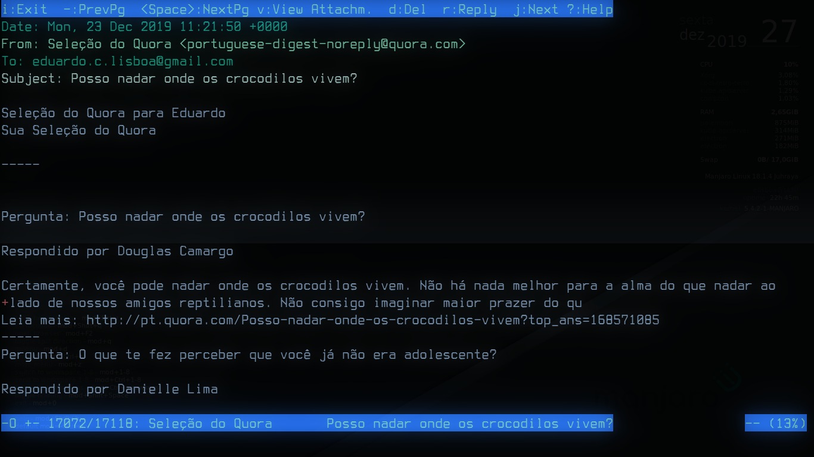
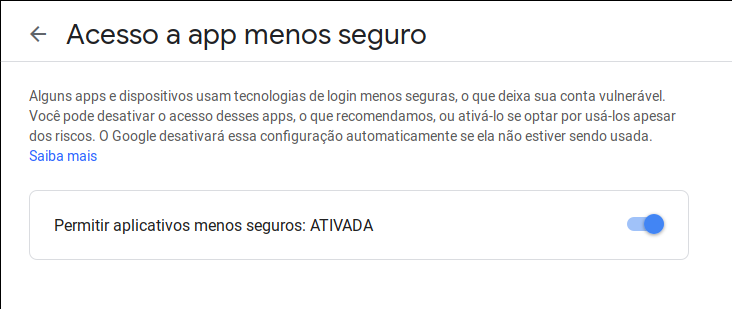
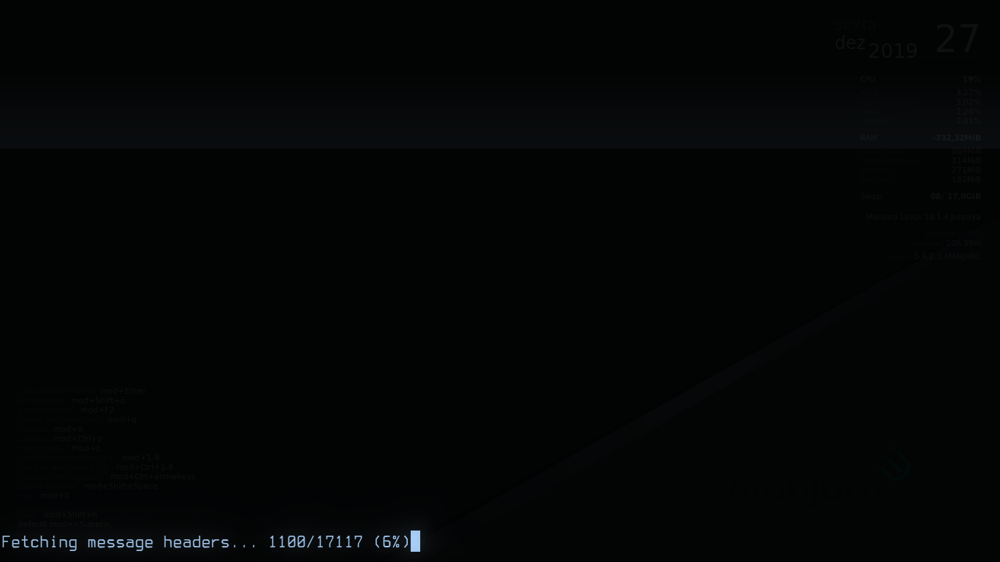
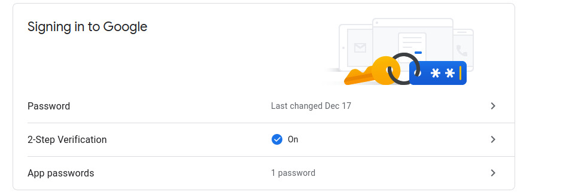
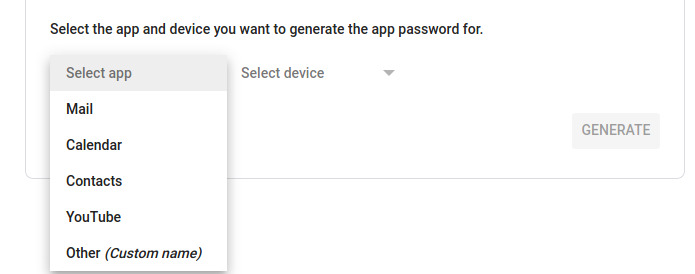
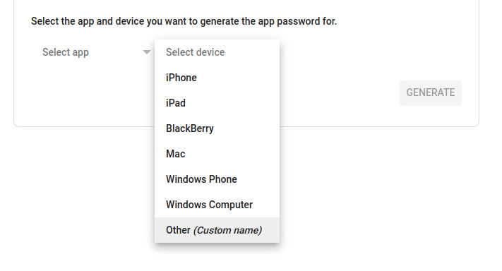
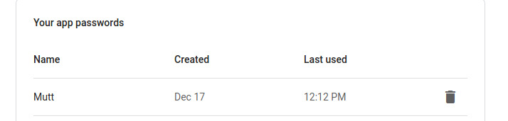
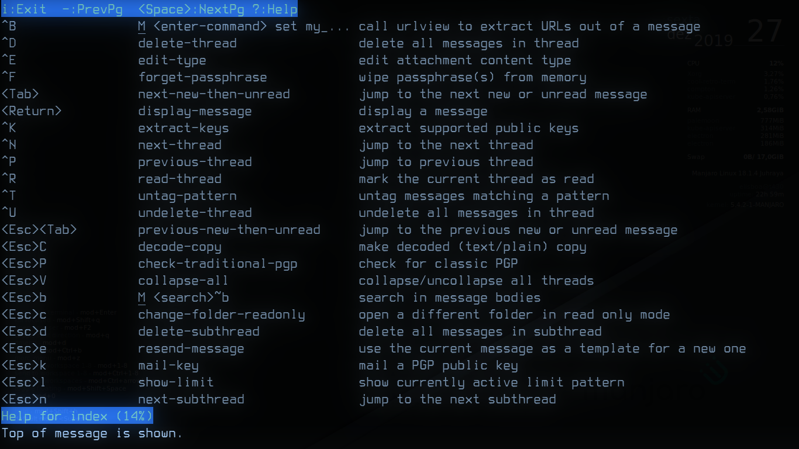

# Lendo emails no terminal



## Introdução

E aí, já pensou em deixar sua vida mais produtiva e deixar seu mouse de lado pelo menos um pouco? Que tal usarmos um gerenciador de emails via terminal?

Vamos utilizar uma série de ferramentas ao migrarmos para o modo [CLI](https://pt.wikipedia.org/wiki/Interface_de_linha_de_comandos), ou seja, o terminal. Hoje iniciaremos com o gerenciador de emails mutt.

Você ainda não conhece o mutt? Nacredito! Mas fique calmo ou calma e leia este fantástico manual: http://www.mutt.org/doc/manual

Tá, mas e agora, como fazer essa bagaça funcionar? Não se deprima, pois é fácil! Quase tão simples como voar! Então, beba aquele café e vamos lá!

## Preparando a brincadeira

### Instalação

Primeiro, instalamos o mutt.

No Debian e derivados (como Ubuntu, Mint etc):

```
sudo apt install -y mutt
```

No Redhat e derivados (como CentOS e Fedora):

```
sudo yum install -y mutt
```

No Arch e derivados (Manjaro etc):

```
sudo pacman -Syu mutt
```

Após instalado, chegou a hora de configurá-lo. A princípio, ele cria automaticamente em seu `$HOME` o arquivo `.muttrc`. Caso não tenha criado, utilize este comando:

```
touch ~/.muttrc
```

### Configuração inicial

Seguem algumas configurações básicas:

```
set editor=vim # Aqui setamos nosso editor de preferência
set signature= # Aqui colocaremos a assinatura caso precisamos
set from="meuemail@gmail.com"
set realname="Meu nome"
```

**Abaixo temos a configuração do IMAP. O foco aqui não é explicar como ativar isso. Veja o manual do seu provedor de e-mail para instruções de como habilitar e utilizar o IMAP**

```
set imap_user="meuemail@gmail.com" #seu email
set imap_pass="pass" # falaremos mais abaixo sobre a senha para o GMail
set smtp_url="smtp://meuemail@gmail.com@smtp.gmail.com:587/" # configuração do SMTP do gmail
set smtp_pass="pass"
set ssl_starttls=yes # Habilitar criptografia para se comunicar com o servidor de e-mail
set ssl_force_tls=yes # Forçar o uso de criptografia (senão, ele tenta se conectar sem criptografia ao falhar a conexão utilizando criptografia)
set folder="imaps://imap.gmail.com:993" # configuração de IMAP do GMail
set spoolfile="+INBOX" # no caso estamos personalizando a nossa caixa de entrada
set timeout=10 # muito importante, pois definimos de quantos em quantos minutos ele vai checar se teremos novos e-mails
```

### Configuração adicional

Segue abaixo uma perfumaria opcional:

```
# Cores
color normal     white black
color attachment brightyellow black
color hdrdefault cyan black
color indicator  black cyan
color markers    brightred black
color quoted     green black
color signature  cyan black
color status     brightgreen blue
color tilde      blue black
color tree       red black
color sidebar_new yellow default
color index     yellow         default  ~N      # New
color index     yellow         default  ~O      # Old
color header    yellow         default  "^from"
color header    brightgreen    default  "^from:"
color header    green      default  "^to:"
color header    green      default  "^cc:"
color header    green      default  "^date:"
color header    yellow     default  "^newsgroups:"
color header    yellow     default  "^reply-to:"
color header    brightcyan default  "^subject:"
color header    red        default  "^x-spam-rule:"
color header    yellow     default  "^x-mailer:"
color header    yellow     default  "^message-id:"
color header    yellow     default  "^Organization:"
color header    yellow     default  "^Organisation:"
color header    yellow     default  "^User-Agent:"
color header    yellow     default  "^message-id: .*pine"
color header    yellow     default  "^X-Fnord:"
color header    yellow     default  "^X-WebTV-Stationery:"
color header    yellow     default  "^X-Message-Flag:"
color header    yellow     default  "^X-Spam-Status:"
color header    yellow     default  "^X-SpamProbe:"
color header    red        default  "^X-SpamProbe: SPAM"
color body      yellow     default  "[;:]-[)/(|]"  # colorise smileys
```

**Você pode baixar o arquivo todo [aqui](.muttrc)**

## Acertando os ponteiros parte um

Para configurar o GMail no mutt, a senha utilizada no seu e-mail via acesso web pode não funcionar, pois o Google não conhece o mutt e bloqueia seu uso. A solução para isso é:

Acesse sua conta do Google e vá em:

[Gerenciar sua conta](https://myaccount.google.com) → Segurança → Acesso a app menos seguro:



Marque a opção para habilitar e pronto. Se você ainda não tiver rodado o mutt, faça agora:

```
mutt
```

## Acertando os ponteiros parte dois



Caso você tenha MFA habilitado e/ou o mutt tenha sido bloqueado, você vai precisar ir em [Gerenciar sua conta](https://myaccount.google.com) → segurança:



Então, vá em Gerenciar sua conta → segurança → Conectando ao Google → Senha de aplicativo:


Em seguida, vá em "Selecionar aplicação". Depois em "Selecionar dispositivo" e então em "outro".



Feito isso, ele vai gerar uma senha para você. Sua senha para acesso via webmail continuará a mesma. 



Guarde essa senha gerada, volte às configurações do mutt e no campo pass coloque ela. Rode o `mutt` no terminal e POW!!! Você está agora recebendo e enviando e-mails pelo terminal.

## Uso básico inicial 

Para utilizar o mutt, você precisa sempre prestar atenção aos atalhos de teclado mostrados na parte superior. Existem muitos outros atalhos exibidos ao se digitar `?`



## Conclusão e observações

Este post foi idealizado e escrito por [Carlos Loyola](https://github.com/cloyol1), um dos nossos parceiros nesse pequeno e humilde blog. Se tiver alguma sugestão ou quiser colaborar, [entre em contato você também](mailto:eduardo.lisboa@gmail.com)!

**Dica: no vim, ao responder um e-mail contendo o corpo da mensagem original, utilize a tecla `O` em vez do tradicional `i`. Mas tem que ser o `O` maiúsculo mesmo, não o `o`. Isto vai jogar a linha atual para baixo e criar uma linha nova logo acima. Este é o melhor jeito de se responder e-mails com o corpo da mensagem anterior `;-)`**
